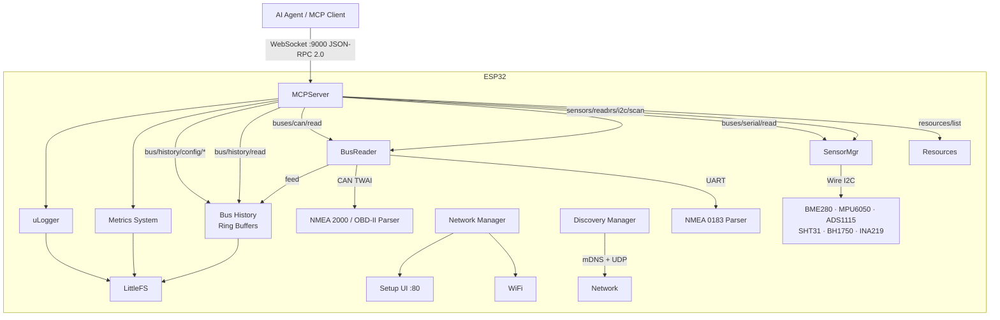

# ESP32 MCP Server

[](https://github.com/navado/ESP32MCPServer/actions/workflows/build.yml)

A [Model Context Protocol](https://modelcontextprotocol.io/) (MCP) server running on ESP32 (and Nordic nRF52840 in sensor-only mode), exposing real-world sensor data and bus protocols to AI assistants and automation tooling over WebSocket / JSON-RPC 2.0.

Connect an AI agent directly to your hardware: query I2C sensors, parse NMEA 0183 GPS/marine data, decode NMEA 2000 and OBD-II CAN frames, replay bus history — all through a standard MCP interface.


---

## Features

| Capability | Details |
|---|---|
| **MCP Protocol** | JSON-RPC 2.0 over WebSocket, resource discovery & subscriptions |
| **I2C Sensors** | Auto-scan + drivers for BME280, MPU6050, ADS1115, SHT31, BH1750, INA219 |
| **NMEA 0183** | GGA, RMC, VTG, GSV, MWV, DBT, DPT, HDG, HDT with XOR checksum validation |
| **NMEA 2000 / CAN** | 29-bit PGNs: position, heading, speed, depth, wind, attitude, water temp |
| **OBD-II / CAN** | Standard 11-bit OBD-II service 01/09 PID decoding (60+ PIDs) |
| **Bus History** | Persistent ring buffers for CAN, NMEA, NMEA 2000, OBD-II — queryable via MCP |
| **Bus Readers** | Time-bounded serial and CAN reads, raw or parsed mode, JSON output |
| **WiFi** | AP setup UI + STA mode; credentials stored in NVS |
| **Discovery** | mDNS (`_mcp._tcp`) + UDP capability broadcast |
| **Metrics** | Heap, uptime, RSSI, histogram stats with boot persistence |
| **Multi-board** | ESP32-S3, ESP32-C3, ESP32, Adafruit HUZZAH32, M5Stack, Nordic nRF52840-DK, Adafruit Feather nRF52840 |
| **Testing** | Native unit tests (Unity), mock I2C / CAN / Serial / LittleFS |

---

## Supported Boards

### ESP32 Boards — Full MCP Server (WiFi + WebSocket + CAN)

| Board | PlatformIO env | MCU | Flash | RAM | WiFi | BLE | CAN | RGB LED |
|---|---|---|---|---|---|---|---|---|
| **ESP32-S3-DevKitC-1** | `esp32-s3-devkitc-1` | Xtensa LX7 × 2 @ 240 MHz | 8 MB | 512 KB + 8 MB PSRAM | ✓ | 5.0 | ✓ | GPIO48 |
| **ESP32-DevKitC V4** | `esp32-devkitc` | Xtensa LX6 × 2 @ 240 MHz | 4 MB | 520 KB | ✓ | 4.2 | ✓ | — |
| **ESP32-C3-DevKitM-1** | `esp32-c3-devkitm-1` | RISC-V @ 160 MHz | 4 MB | 400 KB | ✓ | 5.0 | ✓ | GPIO8 |
| **Adafruit HUZZAH32** | `adafruit-huzzah32` | Xtensa LX6 × 2 @ 240 MHz | 4 MB | 520 KB | ✓ | 4.2 | ✓ | — |
| **M5Stack Core ESP32** | `m5stack-core` | Xtensa LX6 × 2 @ 240 MHz | 16 MB | 520 KB | ✓ | 4.2 | ✗ | — |

### nRF52840 Boards — Sensor Only (I2C + Serial, no WiFi)

| Board | PlatformIO env | MCU | Flash | RAM | BLE |
|---|---|---|---|---|---|
| **Nordic nRF52840-DK** | `nrf52840-dk` | Cortex-M4F @ 64 MHz | 1 MB | 256 KB | 5.0 + 802.15.4 |
| **Adafruit Feather nRF52840** | `nrf52840-feather` | Cortex-M4F @ 64 MHz | 1 MB | 256 KB | 5.0 |

> nRF52840 targets run a separate `main_nrf.cpp` entry point: sensors + I2C + Serial output only. No WiFi, no MCP WebSocket, no LittleFS, no bus history. For full MCP-over-WiFi, bridge via an ESP32-C3 in AT-command mode connected to UART1.

### Board Feature Matrix

| Feature | ESP32-S3 | ESP32 V4 | ESP32-C3 | HUZZAH32 | M5Stack | nRF52840-DK | nRF52840-Feather |
|---|---|---|---|---|---|---|---|
| WiFi | ✓ | ✓ | ✓ | ✓ | ✓ | ✗ | ✗ |
| BLE | ✓ | ✓ | ✓ | ✓ | ✓ | ✓ | ✓ |
| CAN / TWAI | ✓ | ✓ | ✓ | ✓ | ✗ | ✗ | ✗ |
| I2C | ✓ | ✓ | ✓ | ✓ | ✓ | ✓ | ✓ |
| UART (ext) | ✓ | ✓ | ✓ | ✓ | ✓ | ✓ | ✓ |
| LittleFS | ✓ | ✓ | ✓ | ✓ | ✓ | ✗ | ✗ |
| MCP Server | ✓ | ✓ | ✓ | ✓ | ✓ | ✗ | ✗ |
| Bus History | ✓ | ✓ | ✓ | ✓ | ✓ | ✗ | ✗ |
| mDNS / UDP discovery | ✓ | ✓ | ✓ | ✓ | ✓ | ✗ | ✗ |

---

## Architecture



---

## Hardware

### Pin Assignments (ESP32-S3-DevKitC-1)

| GPIO | Function | Connected to |
|---|---|---|
| IO8 | I2C SDA | All I2C sensors |
| IO9 | I2C SCL | All I2C sensors |
| IO16 | UART1 RX | GPS / chart plotter TX |
| IO17 | UART1 TX | GPS / chart plotter RX (optional) |
| IO4 | CAN RX | TJA1050 / SN65HVD230 CRXD |
| IO5 | CAN TX | TJA1050 / SN65HVD230 CTXD |

### nRF52840-DK Pin Assignments

| Pin | Function |
|---|---|
| P0.26 / D6 | I2C SDA |
| P0.27 / D7 | I2C SCL |
| P0.06 / TX | UART1 TX |
| P0.08 / RX | UART1 RX |

### Bill of Materials

| # | Part | Purpose |
|---|---|---|
| 1 | ESP32-S3-DevKitC-1 | Main MCU |
| 1 | BME280 breakout | Temperature / Humidity / Pressure |
| 1 | MPU6050 breakout | 6-axis IMU (optional) |
| 1 | TJA1050 or SN65HVD230 | CAN bus transceiver (optional) |
| 1 | GPS module (3.3 V UART) | NMEA 0183 position/time (optional) |
| 2 | 4.7 kΩ resistors | I2C pull-ups |
| — | Breadboard + jumpers | |

### ESP32-S3-DevKitC-1 Wiring

```
                    ┌──────────────────────────────────────┐
                    │         ESP32-S3-DevKitC-1            │
                    │                                       │
             3V3 ───┤ 3V3                          GND ├─── GND
             GND ───┤ GND                          IO0 ├
                    │                                   │
  I2C SDA ── IO8 ───┤ IO8  ┌──────────┐       IO17 ├─── UART1 TX → GPS
  I2C SCL ── IO9 ───┤ IO9  │  ESP32   │       IO16 ├─── UART1 RX ← GPS
                    │ IO10 │    S3    │       IO15 ├
                    │ IO11 └──────────┘       IO14 ├
                    │ IO12                    IO13 ├
                    │ IO3                      IO4 ├─── CAN RX ← TJA1050
                    │ IO46                     IO5 ├─── CAN TX → TJA1050
                    │                               │
                    │    USB (flash / serial log)   │
                    └───────────────────────────────┘
```

### I2C Sensor Wiring

All sensors share one bus. Add 4.7 kΩ pull-ups from SDA and SCL to 3V3.

```
ESP32-S3      BME280       MPU6050      ADS1115      INA219
─────────     ───────      ───────      ───────      ───────
IO8 (SDA)─────SDA──────────SDA──────────SDA──────────SDA
IO9 (SCL)─────SCL──────────SCL──────────SCL──────────SCL
3V3  ──────────VCC──────────VCC──────────VCC──────────VCC
GND  ──────────GND──────────GND──────────GND──────────GND
               SDO→GND      AD0→GND      ADDR→GND
               (0x76)       (0x68)       (0x48)       (0x40)
```

Other supported sensors (same bus wiring): **SHT31** (0x44), **BH1750** (0x23).

### NMEA 0183 Wiring (GPS / Chart Plotter)

```
GPS / chart plotter              ESP32-S3
───────────────────              ────────
TX  (3.3 V TTL NMEA out) ─────── IO16 (UART1 RX)
RX  (optional NMEA in)   ─────── IO17 (UART1 TX)
GND                      ─────── GND
VCC (3.3 V)              ─────── 3V3
```

> If the device outputs RS-232 levels, use a MAX3232 level shifter. Never connect RS-232 directly to ESP32 GPIO.

### CAN Bus Wiring (NMEA 2000 / OBD-II)

```
TJA1050 / SN65HVD230             ESP32-S3
────────────────────             ────────
CTXD                  ─────────── IO5 (CAN TX)
CRXD                  ─────────── IO4 (CAN RX)
VCC (5 V for TJA1050) ─────────── VIN / external 5 V
GND                   ─────────── GND
CANH ──────────────── NMEA 2000 backbone / OBD-II CANH
CANL ──────────────── NMEA 2000 backbone / OBD-II CANL
```

> NMEA 2000 runs at 250 kbps. OBD-II runs at 500 kbps. Set the baud rate in your `CANBusReader` configuration accordingly.

---

## Software Prerequisites

- [PlatformIO Core](https://docs.platformio.org/en/stable/core/index.html) CLI or the PlatformIO IDE plugin for VS Code
- Python 3.8+
- Git

```bash
pip install platformio
```

---

## Build & Flash

```bash
# 1. Clone
git clone https://github.com/navado/ESP32MCPServer.git
cd ESP32MCPServer

# 2. Install library dependencies
pio pkg install

# 3. Upload web assets to LittleFS (optional but recommended)
pio run -t uploadfs -e esp32-s3-devkitc-1

# 4. Build firmware
pio run -e esp32-s3-devkitc-1

# 5. Flash
pio run -t upload -e esp32-s3-devkitc-1

# 6. Monitor
pio device monitor --baud 115200
```

### nRF52840

```bash
pio run -e nrf52840-dk
pio run -t upload -e nrf52840-dk
```

---

## First Run

1. Power on the board. It broadcasts a WiFi AP: **`ESP32_XXXXXX`** (last 6 hex digits of the MAC address).
2. Connect to that AP and open **`http://192.168.4.1`**.
3. Enter your WiFi credentials and click Save.
4. The board joins your network and prints its IP address on the serial console.
5. Connect an MCP client to **`ws://<IP>:9000`**.

---

## Web Dashboard

A browser-based dashboard is served from flash at **`http://<IP>/app`**.

| Tab | What it does |
|---|---|
| **Sensors** | Scan I²C bus, display detected devices, read values, auto-refresh |
| **Metrics** | List all metrics, live values, sparkline history chart |
| **Logs** | Query and clear metric log entries |
| **MCP Console** | Interactive JSON-RPC console with preset requests and live message log |

---

## HTTP Endpoints (port 80)

| Method | Path | Description |
|---|---|---|
| GET | `/` | WiFi setup page |
| POST | `/save` | Save WiFi credentials (`ssid`, `password` form params) |
| GET | `/status` | Network status JSON |
| WS | `/ws` | Real-time network status WebSocket |
| GET | `/app` | Browser dashboard |
| GET | `/bus-history` | Read bus history config JSON |
| POST | `/bus-history` | Update bus history config JSON |

---

## MCP API Reference (WebSocket port 9000)

All methods use **JSON-RPC 2.0** over WebSocket.

### Protocol

| Method | Params | Description |
|---|---|---|
| `initialize` | — | Server info, protocol version, capabilities |
| `resources/list` | — | List registered MCP resources |
| `resources/read` | `uri` | Read a resource by URI |
| `resources/subscribe` | `uri` | Subscribe to push updates for a resource |
| `resources/unsubscribe` | `uri` | Cancel a subscription |

### Sensors

| Method | Params | Description |
|---|---|---|
| `sensors/i2c/scan` | — | Scan I²C bus; auto-detect and initialise drivers |
| `sensors/read` | `sensorId?` | Read all channels of one sensor (omit ID to read all) |

#### `sensors/i2c/scan`

```json
{"jsonrpc":"2.0","method":"sensors/i2c/scan","id":1}
```
```json
{
  "jsonrpc":"2.0","id":1,
  "result":{"devices":[
    {"address":118,"name":"BME280","supported":true,"parameters":["temperature","pressure","humidity"]},
    {"address":104,"name":"MPU6050","supported":true,"parameters":["accel_x","accel_y","accel_z","gyro_x","gyro_y","gyro_z","temperature"]}
  ]}
}
```

#### `sensors/read`

```json
{"jsonrpc":"2.0","method":"sensors/read","id":2,"params":{"sensorId":"bme280_0x76"}}
```
```json
{
  "jsonrpc":"2.0","id":2,
  "result":{"readings":[
    {"sensorId":"bme280_0x76","parameter":"temperature","value":22.4,"unit":"°C","timestamp":1234567890,"valid":true},
    {"sensorId":"bme280_0x76","parameter":"humidity","value":58.1,"unit":"%RH","timestamp":1234567890,"valid":true},
    {"sensorId":"bme280_0x76","parameter":"pressure","value":101320.0,"unit":"Pa","timestamp":1234567890,"valid":true}
  ]}
}
```

### Bus History

Bus history accumulates CAN frames, NMEA lines, decoded NMEA 2000 messages, and OBD-II records in circular RAM buffers. The buffers are sized from a configurable RAM budget and their configuration is persisted to LittleFS.

| Method | Params | Description |
|---|---|---|
| `bus/history/read` | `type`, `limit?` | Read accumulated messages from history buffers |
| `bus/history/config/get` | — | Read current buffer sizing configuration |
| `bus/history/config/set` | config fields | Resize buffers and persist configuration |

#### `bus/history/read`

`type` must be one of: `can`, `nmea`, `nmea2000`, `obdii`. `limit` defaults to all stored entries.

```json
{"jsonrpc":"2.0","method":"bus/history/read","id":3,"params":{"type":"can","limit":10}}
```
```json
{
  "jsonrpc":"2.0","id":3,
  "result":{
    "type":"can",
    "frames":["7E8#0441050300000000","7E8#04410D0000000000"],
    "count":2,
    "capacity":500
  }
}
```

```json
{"jsonrpc":"2.0","method":"bus/history/read","id":4,"params":{"type":"nmea2000"}}
```
```json
{
  "jsonrpc":"2.0","id":4,
  "result":{
    "type":"nmea2000",
    "messages":[
      {"pgn":129025,"priority":2,"source":0,"name":"Position Rapid Update",
       "valid":true,"hasPosition":true,"latitude":47.6097,"longitude":-122.3331}
    ],
    "count":1,"capacity":200
  }
}
```

```json
{"jsonrpc":"2.0","method":"bus/history/read","id":5,"params":{"type":"obdii"}}
```
```json
{
  "jsonrpc":"2.0","id":5,
  "result":{
    "type":"obdii",
    "records":[
      {"service":1,"pid":12,"name":"Engine RPM","value":1500,"unit":"rpm","valid":true},
      {"service":1,"pid":13,"name":"Vehicle Speed","value":65,"unit":"km/h","valid":true}
    ],
    "count":2,"capacity":300
  }
}
```

#### `bus/history/config/get`

```json
{"jsonrpc":"2.0","method":"bus/history/config/get","id":6}
```
```json
{
  "jsonrpc":"2.0","id":6,
  "result":{
    "canFrameCount":500,
    "nmeaLineCount":1000,
    "nmea2000Count":200,
    "obdiiCount":300,
    "ramBudgetBytes":1048576,
    "safetyMarginBytes":65536,
    "freeHeapBytes":2097152
  }
}
```

#### `bus/history/config/set`

All fields are optional; omitted fields retain their current values.

```json
{
  "jsonrpc":"2.0","method":"bus/history/config/set","id":7,
  "params":{"canFrameCount":1000,"ramBudgetBytes":2097152}
}
```
```json
{"jsonrpc":"2.0","id":7,"result":{"ok":true,"canFrameCount":1000,"nmeaLineCount":1000,"nmea2000Count":200,"obdiiCount":300,"ramBudgetBytes":2097152,"safetyMarginBytes":65536}}
```

> Set `canFrameCount`, `nmeaLineCount`, `nmea2000Count`, `obdiiCount` all to `0` to enable auto-sizing: the server splits `ramBudgetBytes` equally among the four buffer types based on the size of each record type.

### Metrics

| Method | Params | Description |
|---|---|---|
| `metrics/list` | `category?` | List all registered metrics (name, type, unit, category) |
| `metrics/get` | `name` | Current value of one metric |
| `metrics/history` | `name`, `seconds?` | Historical samples for one metric (default: last 300 s) |

#### `metrics/list`

```json
{"jsonrpc":"2.0","method":"metrics/list","id":8,"params":{"category":"system"}}
```
```json
{
  "jsonrpc":"2.0","id":8,
  "result":{"metrics":[
    {"name":"system.heap.free","type":"gauge","description":"Free heap","unit":"bytes","category":"system"},
    {"name":"system.uptime","type":"counter","description":"Uptime","unit":"s","category":"system"},
    {"name":"system.wifi.rssi","type":"gauge","description":"WiFi signal strength","unit":"dBm","category":"system"}
  ]}
}
```

Metric types: `counter` (cumulative integer), `gauge` (current value), `histogram` (min/max/mean/count object).

#### `metrics/get`

```json
{"jsonrpc":"2.0","method":"metrics/get","id":9,"params":{"name":"system.heap.free"}}
```
```json
{
  "jsonrpc":"2.0","id":9,
  "result":{"name":"system.heap.free","type":"gauge","value":214032,"unit":"bytes","category":"system","timestamp":1234567890}
}
```

For histogram metrics, `value` is an object: `{"mean":…,"min":…,"max":…,"count":…}`.

#### `metrics/history`

```json
{"jsonrpc":"2.0","method":"metrics/history","id":10,"params":{"name":"system.heap.free","seconds":60}}
```
```json
{
  "jsonrpc":"2.0","id":10,
  "result":{"name":"system.heap.free","entries":[
    {"ts":1234567800,"val":214100},
    {"ts":1234567830,"val":214032}
  ]}
}
```

### Logs

| Method | Params | Description |
|---|---|---|
| `logs/query` | `name?`, `seconds?` | Query binary metric log (default: last 3600 s) |
| `logs/clear` | — | Delete all log entries from LittleFS |

```json
{"jsonrpc":"2.0","method":"logs/query","id":11,"params":{"name":"system.heap.free","seconds":120}}
```
```json
{
  "jsonrpc":"2.0","id":11,
  "result":{"name":"system.heap.free","count":4,"entries":[
    {"ts":1234567810,"val":214100},
    {"ts":1234567840,"val":214032}
  ]}
}
```

```json
{"jsonrpc":"2.0","method":"logs/clear","id":12}
```
```json
{"jsonrpc":"2.0","id":12,"result":{"ok":true}}
```

### Subscriptions

```json
{"jsonrpc":"2.0","method":"resources/subscribe","id":13,"params":{"uri":"sensor://i2c/bme280_0x76"}}
```

After subscribing the server pushes unsolicited `notifications/resources/updated` on every value change:

```json
{"jsonrpc":"2.0","method":"notifications/resources/updated","params":{"uri":"sensor://i2c/bme280_0x76"}}
```

### TypeScript client example

See [`examples/client/client.ts`](examples/client/client.ts) for a complete typed client.

---

## I2C Sensor Reference

| Sensor | Addresses | Parameters | Units |
|---|---|---|---|
| **BME280 / BMP280** | 0x76, 0x77 | `temperature`, `pressure`, `humidity`¹ | °C, Pa, %RH |
| **MPU6050** | 0x68, 0x69 | `accel_x/y/z`, `gyro_x/y/z`, `temperature` | g, °/s, °C |
| **ADS1115** | 0x48–0x4B | `ch0_V`, `ch1_V`, `ch2_V`, `ch3_V` | V (±4.096 range) |
| **SHT31** | 0x44, 0x45 | `temperature`, `humidity` | °C, %RH |
| **BH1750** | 0x23, 0x5C | `light_lux` | lux |
| **INA219** | 0x40–0x4F | `bus_voltage_V`, `shunt_mV`, `current_mA`, `power_mW` | V, mV, mA, mW |

¹ `humidity` is not available on BMP280.

---

## NMEA 0183 Sentences Supported

| Sentence | Description | Fields Decoded |
|---|---|---|
| **GGA** | GPS Fix Data | time, lat, lon, fix quality, satellites, HDOP, altitude, geoid separation |
| **RMC** | Recommended Minimum Navigation | time, active, lat, lon, speed (kn & km/h), course, magnetic variation |
| **VTG** | Track Made Good / Ground Speed | course (true & magnetic), speed (kn & km/h) |
| **GSV** | Satellites in View | total satellites, per-satellite PRN, elevation, azimuth, SNR |
| **MWV** | Wind Speed and Angle | angle, relative/true, speed, unit (K/M/N) |
| **DBT** | Depth Below Transducer | depth (feet / metres / fathoms) |
| **DPT** | Depth of Water | depth (metres) |
| **HDG** | Heading – Deviation & Variation | heading, deviation, variation (E/W) |
| **HDT** | Heading – True | heading (true north) |

Parsing features: XOR checksum validation, DDMM.MMMM → signed decimal degrees, HHMMSS.SS time, talker ID extraction, graceful empty-field handling.

---

## NMEA 2000 PGNs Supported

| PGN | Name | Key Fields |
|---|---|---|
| **127250** | Vessel Heading | `heading`, `variation` |
| **127257** | Attitude | `pitch`, `roll`, `yaw` |
| **128259** | Speed Through Water | `speedKnots` |
| **128267** | Water Depth | `depthMetres`, `offset` |
| **129025** | Position Rapid Update | `latitude`, `longitude` |
| **129026** | COG & SOG | `courseOverGround`, `speedOverGround` |
| **130306** | Wind Data | `speedKnots`, `angle`, apparent/true flag |
| **130310** | Water Temperature | `tempCelsius` |

---

## OBD-II PIDs Supported (Service 01)

Selected PIDs decoded; full list in `src/CANParser.cpp`:

| Category | PIDs |
|---|---|
| **Engine** | RPM, load, coolant temp, intake air temp, MAP, MAF, timing advance |
| **Fuel** | Fuel pressure, trim (short/long), rail pressure, injection timing, fuel rate |
| **Emissions** | O2 sensor voltages, EGR, evap system, DPF pressure |
| **Motion** | Vehicle speed, throttle position, accelerator pedal position |
| **Temperature** | Oil temp, intake air temp, EGR temp, engine exhaust gas temps (EGT) |
| **Electrical** | Control module voltage, battery voltage |
| **Hybrid** | Hybrid battery remaining life |
| **Torque** | Driver demand, actual torque, reference torque |
| **Vehicle info** | VIN, calibration IDs (service 09) |

---

## Discovery

On network connect the server registers two mDNS services and periodically sends a UDP capability beacon:

| Discovery | Details |
|---|---|
| **mDNS** | `_mcp._tcp` and `_http._tcp` with TXT records: version, capabilities, detected sensors |
| **UDP broadcast** | JSON beacon to `255.255.255.255:5354` every 30 s (configurable); includes sensor manifest |

mDNS and UDP are triggered automatically on network join, I2C scan completion, MCP server ready, and bus history config changes.

---

## Testing

Tests compile and run natively on Linux — no hardware required.

```bash
# All tests
pio test -e native

# Specific suites
pio test -e native -f test_nmea_parser
pio test -e native -f test_can_parser
pio test -e native -f test_i2c_sensors
pio test -e native -f test_bus_reader
pio test -e native -f test_mcp_server
pio test -e native -f test_metrics_system

# With coverage (requires lcov)
pio test -e native --coverage
```

| Suite | What is covered |
|---|---|
| `test_nmea_parser` | GGA, RMC, VTG, GSV, MWV, DBT, DPT, HDG, HDT, checksum validation |
| `test_can_parser` | OBD-II PIDs, NMEA 2000 PGNs 127250/127257/128259/128267/129025/129026/130306/130310 |
| `test_i2c_sensors` | BME280, MPU6050, ADS1115, SHT31, BH1750, INA219 via mock I2C |
| `test_bus_reader` | Timed reads, raw/parsed modes, timeout handling |
| `test_mcp_server` | JSON-RPC dispatch, resource management, method registration |
| `test_metrics_system` | Counters, gauges, histograms, LittleFS persistence |

---

## Extending with Custom MCP Methods

Register additional JSON-RPC handlers at runtime:

```cpp
mcpServer.registerMethodHandler("myns/doSomething",
    [](uint8_t clientId, uint32_t reqId, const JsonObject& params) {
        StaticJsonDocument<256> doc;
        doc["result"]["ok"] = true;
        std::string out;
        serializeJson(doc, out);
        return out;
    });

// Remove when no longer needed
mcpServer.unregisterMethodHandler("myns/doSomething");
```

---

## Contributing

1. Fork the repository
2. Create a feature branch: `git checkout -b feature/my-feature`
3. Add tests for new functionality (`pio test -e native` must pass)
4. Open a pull request

See [CONTRIBUTING.md](CONTRIBUTING.md) for coding style and guidelines.

---

## License

MIT — see [LICENSE](LICENSE).
